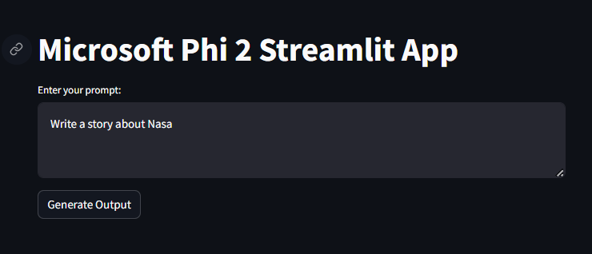

# Microsoft Phi 2 Streamlit App

Welcome to the Microsoft Phi 2 Streamlit App, a powerful and user-friendly application that harnesses the capabilities of the Microsoft Phi 2 language model for text generation. This app, built using Streamlit, allows users to interact with Phi 2 effortlessly and generate contextually rich text based on their prompts.

## Getting Started

1. **Clone the Repository:**
   ```bash
   git clone https://github.com/your-username/microsoft-phi2-streamlit-app.git
   cd microsoft-phi2-streamlit-app
   ```

2. **Install Dependencies:**
   ```bash
   pip install -r requirements.txt
   ```

3. **Run the App:**
   ```bash
   streamlit run app.py
   ```
   This command will launch the app in your default web browser.

## Usage

1. Enter your text prompt in the provided text area.
2. Click the "Generate Output" button to initiate text generation based on your prompt.
3. Explore the generated output provided by the Microsoft Phi 2 language model.

## Customize and Explore

Feel free to explore and customize the app to suit your needs. You can experiment with different prompts, adjust parameters, or even integrate additional features. The codebase is open for further customization and serves as a starting point for various text generation applications.

## Demonstration
* Start screen



* The output in collab notebook


## Working collab notebook copy :

Share : https://gist.github.com/flyfir248/d54f46ab6dd1f1c30e6585b0e77e973e


## Acknowledgments

This app utilizes the Microsoft Phi 2 language model, and we appreciate the contributions from the Microsoft Research team in advancing language model capabilities. Special thanks to the Streamlit development team for providing an excellent framework for building interactive web applications.


## Issues and Contributions

If you encounter any issues or have suggestions for improvements, please feel free to open an issue or submit a pull request. Your contributions are highly valued!

Enjoy generating text with Microsoft Phi 2!
